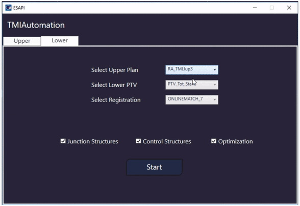

# TMIAutomation

Plug-in script for the Eclipse Treatment Planning System to automate Total Marrow (Lymph-node) Irradiation (TMI/TMLI).

The script was introduced and validated in [this paper](https://doi.org/10.1007/s00066-022-02014-0) on Strahlentherapie und Onkologie.

The generation of the field geometry of TMI/TMLI with deep-learning was introduced in [this paper](https://aapm.onlinelibrary.wiley.com/doi/10.1002/mp.17089) on Medical Physics.
This paper was featured on the **cover** of the **Medical Physics** [Issue of June 2024](https://doi.org/10.1002/mp.15744).

If you liked/used this project, don't forget to give it a star! :star:

## Key features

* Field geometry for the TMI/TMLI upper-body generated with deep-learning models
* Automatic planning of the lower-extremities for TMI/TMLI
* Extendible to VMAT-TBI (Total Body Irradiation delivered with Volumetric Modulated Arc Therapy)

## Usage

### Documentation

The script _Reference Guide_ is located in the `Docs` folder of this repository.
Alternatively, it can be found in the `Docs` folder contained in the release [assets](https://github.com/nlambriICH/TMIAutomation/releases).

### Demo

Example on Eclipse v15:

### Requirements

Tested on **Eclipse v15** and **v16**.

Go to the latest release [page](https://github.com/nlambriICH/TMIAutomation/releases/latest):

* for Eclipse v15: download the zip file `ESAPI15_TMIAutomation-vx.x.x.x.zip`
* for Eclipse v16: download the zip file `ESAPI16_TMIAutomation-vx.x.x.x.zip`

If you are on a research workstation (_TBox_), you can immediately run the script `TMIAutomation.esapi.dll`
by setting the database in research mode from the RT Administration module of Eclipse.
Otherwise, the plug-in script `TMIAutomation.esapi.dll` needs to be **approved** in the Eclipse application.

## Contributing

Any contribution/feedback is **greatly appreciated**!

If you have a suggestion that can improve this project, you can open a new issue [here](https://github.com/nlambriICH/TMIAutomation/issues).

If you want to contribute directly to the code, please follow these steps:

1. Clone this repo from your GitHub account to your local disk: `git clone https://github.com/nlambriICH/TMIAutomation.git`
2. Create your feature branch: `git checkout -b feature-branch`
3. Commit your changes: `git commit -m 'Add new feature'`
4. Push your changes: `git push -u origin feature-branch`
5. Open a pull request [here](https://github.com/nlambriICH/TMIAutomation/pulls)

### Development

Open `TMIAutomation.sln` with [Visual Studio](https://visualstudio.microsoft.com/).

Project structure:

* `TMIAutomation`: plug-in source code
* `TMIAutomation.Runner`: used to run and debug the plug-in
* `TMIAutomation.Tests`: unit tests for the plug-in

## Licence

Distributed under the MIT License. See `LICENSE.md` for more information.

## Contact

Nicola Lambri - nicola.lambri@cancercenter.humanitas.it
